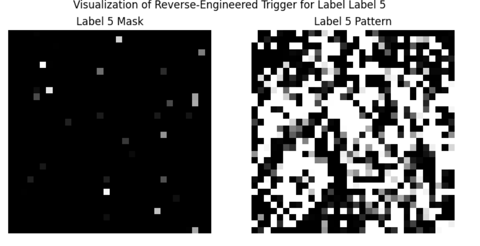
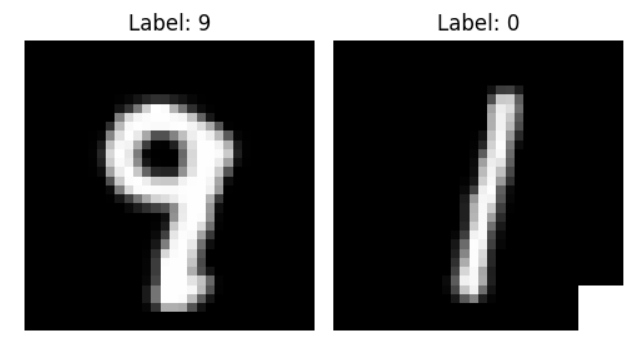
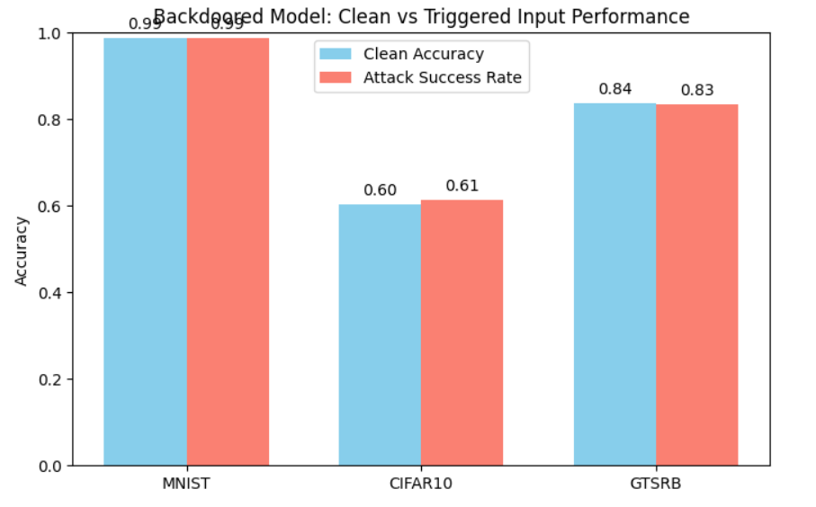

# 🧠 Neural Cleanse: Identifying and Mitigating Backdoor Attacks in Neural Networks

**Based on the IEEE S&P 2019 paper by Wang et al.**

This repository contains a PyTorch implementation of the Neural Cleanse framework, which detects and mitigates backdoor attacks in deep neural networks. Neural Cleanse identifies inputs with small perturbations that can cause a model to misclassify all inputs to the same target label, flagging it as suspicious.

---

## 🎯 Objective
- Detect potential backdoor attacks in pre-trained DNNs.
- Reverse-engineer adversarial triggers and perturbation masks.
- Apply anomaly detection using Median Absolute Deviation (MAD).

---

## ⚙️ Tech Stack
- **Language:** Python 3.8+
- **Framework:** PyTorch
- **Libraries:** NumPy, Torchvision, OpenCV, Matplotlib

---

## 🚀 Features
- 🔍 Reverse-engineers potential backdoor triggers for each class.
- 📊 Computes L1 norm of perturbation masks.
- 🧠 Detects anomaly using MAD outlier score.
- 📈 Visualizes reverse-engineered masks for suspect classes.
- 🧪 Supports clean and backdoored models (BadNet, Trojan, etc).

---

## 📸 Sample Output

### 🔥 Reverse-Engineered Trigger (Target Label Suspected)


### ✅ Trigrred and Clean Sample


---

## 📊 Evaluation Results

---


## 📚 Reference
If you use this implementation, please cite the original paper:
```bibtex
@inproceedings{wang2019neuralcleanse,
  title={Neural Cleanse: Identifying and Mitigating Backdoor Attacks in Neural Networks},
  author={Wang, Bolun and Yao, Yuanshun and Shan, Shawn and Li, Huiying and Viswanath, Bimal and Zheng, Haitao and Zhao, Ben Y},
  booktitle={IEEE Symposium on Security and Privacy (SP)},
  year={2019}
}
```

> Maintained by Sakshi | Internship at DRDO SAG (June 2025 – Present)
